# OneStocks — Project Workflow

## Table of Contents
1. [System Architecture](#1-system-architecture)
2. [Authentication Workflows](#2-authentication-workflows)
3. [Stock Trading Workflow](#3-stock-trading-workflow)
4. [Frontend Routing & Guard Flow](#4-frontend-routing--guard-flow)
5. [Backend Request Pipeline](#5-backend-request-pipeline)
6. [Database Entity Relationships](#6-database-entity-relationships)
7. [Real-time Price Simulation](#7-real-time-price-simulation)
8. [Local Development Setup](#8-local-development-setup)

---

## 1. System Architecture

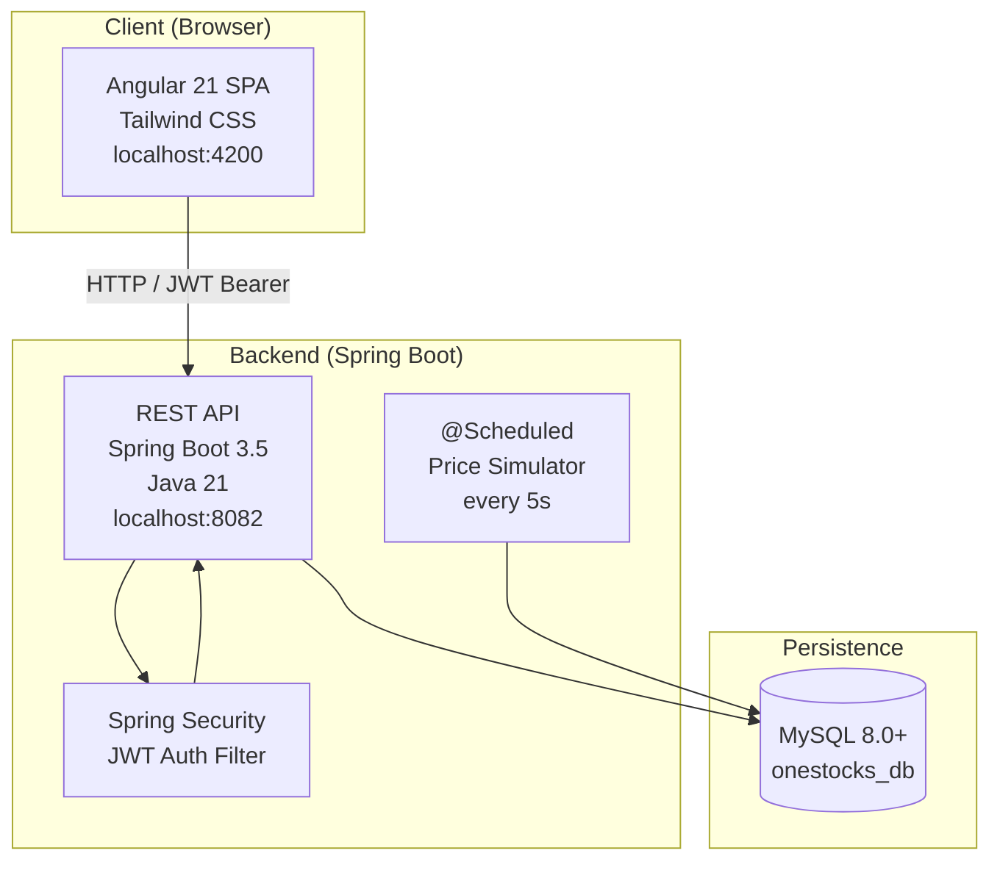

---

## 2. Authentication Workflows

### 2.1 Signup

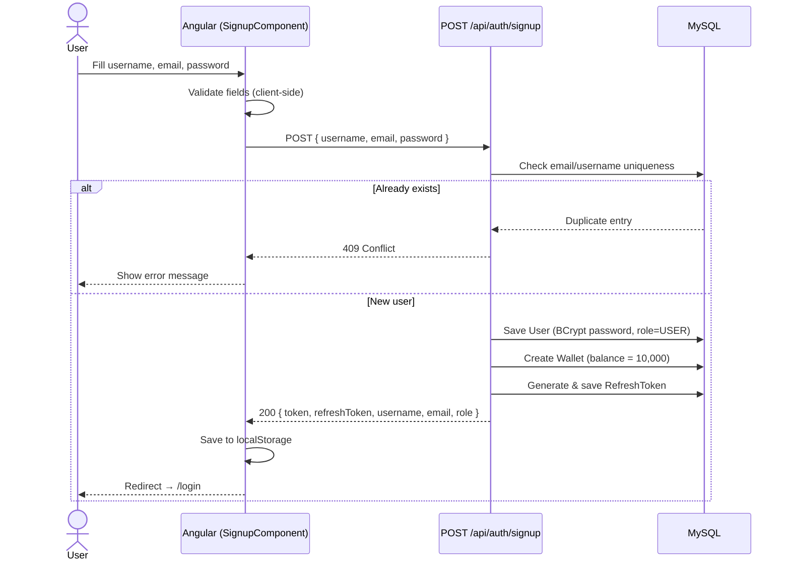

### 2.2 Login

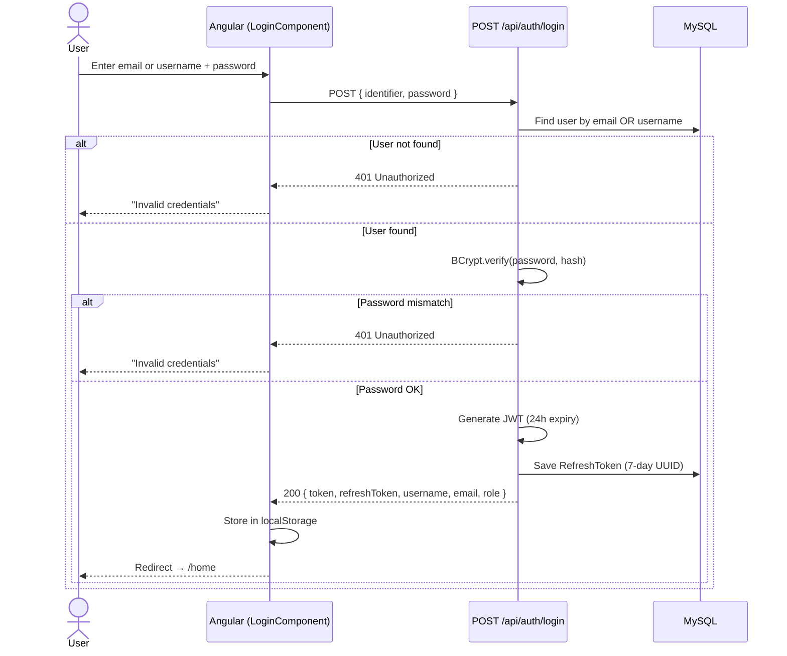

### 2.3 Token Refresh (Silent Auto-Renewal)

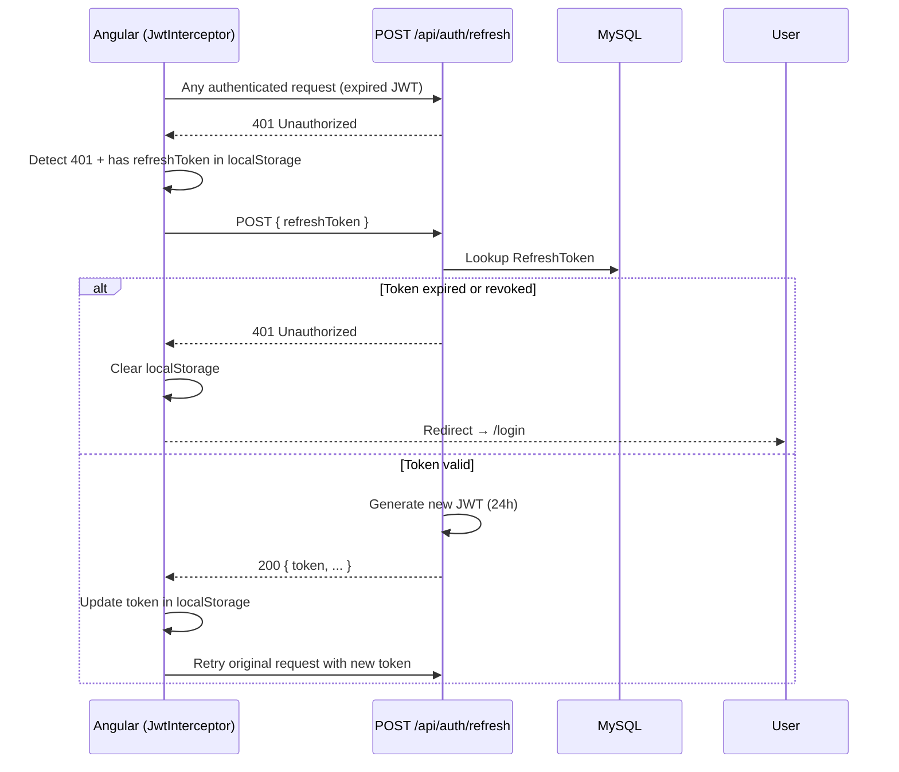

### 2.4 Logout

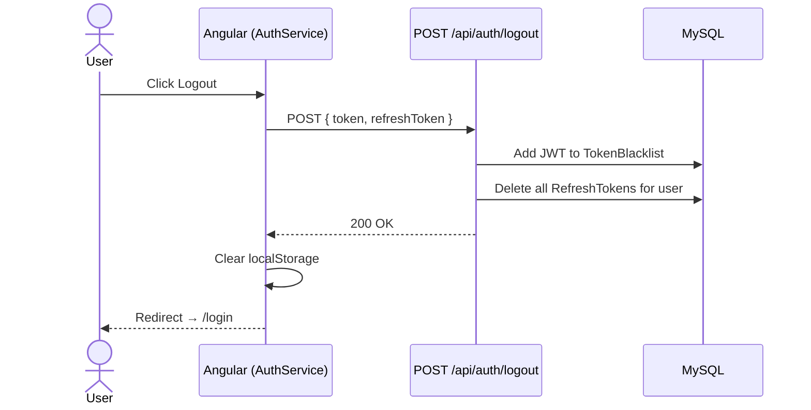

---

## 3. Stock Trading Workflow

### 3.1 Browse Stocks

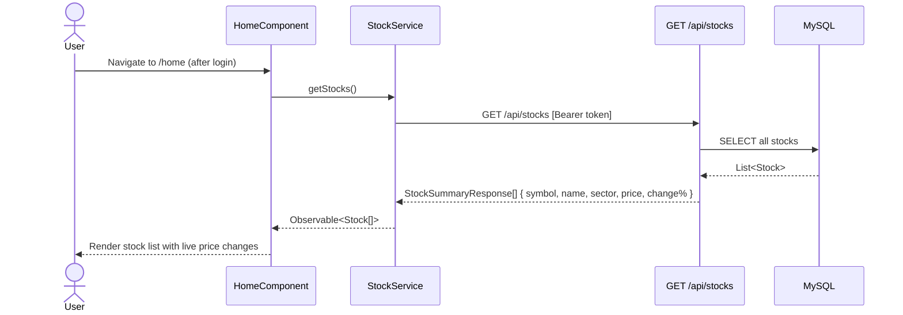

### 3.2 View Stock Detail

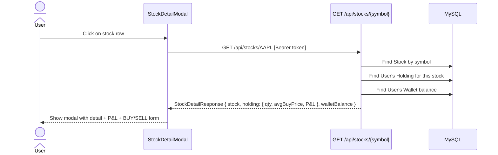

### 3.3 Execute BUY Transaction

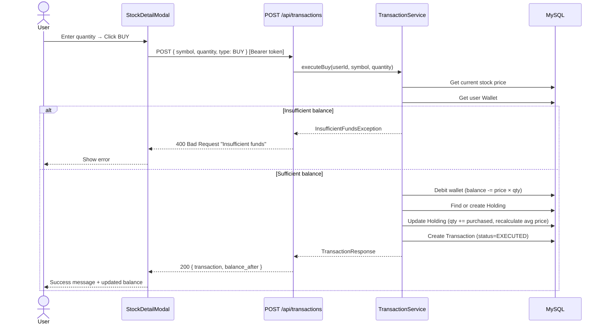

### 3.4 Execute SELL Transaction

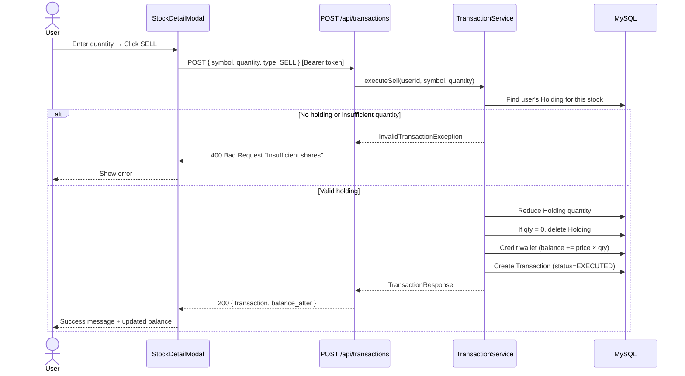

### 3.5 View Portfolio & Transaction History

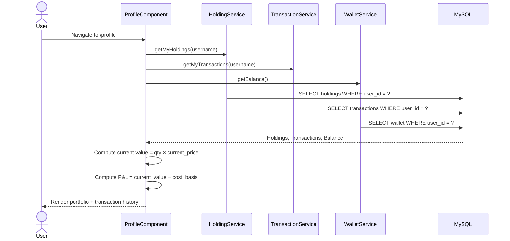

---

## 4. Frontend Routing & Guard Flow

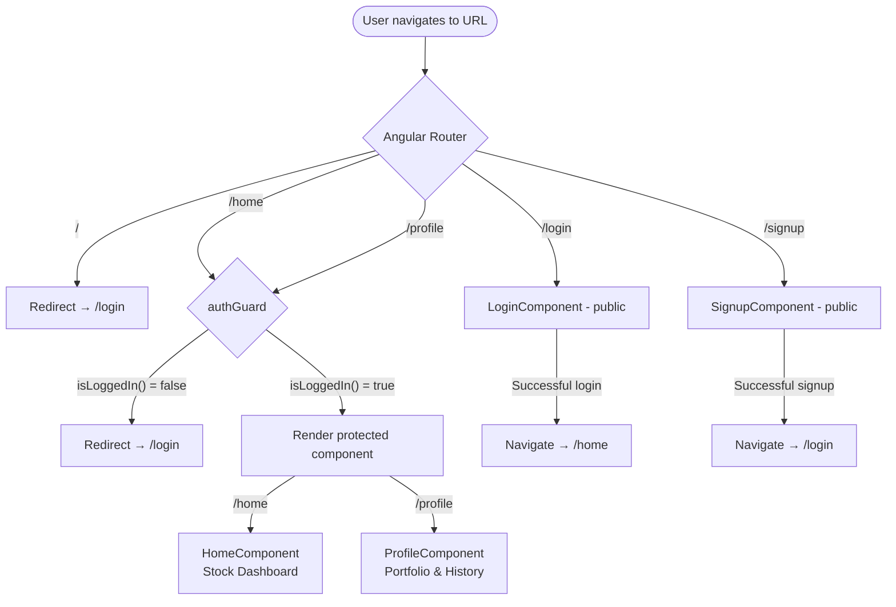

---

## 5. Backend Request Pipeline

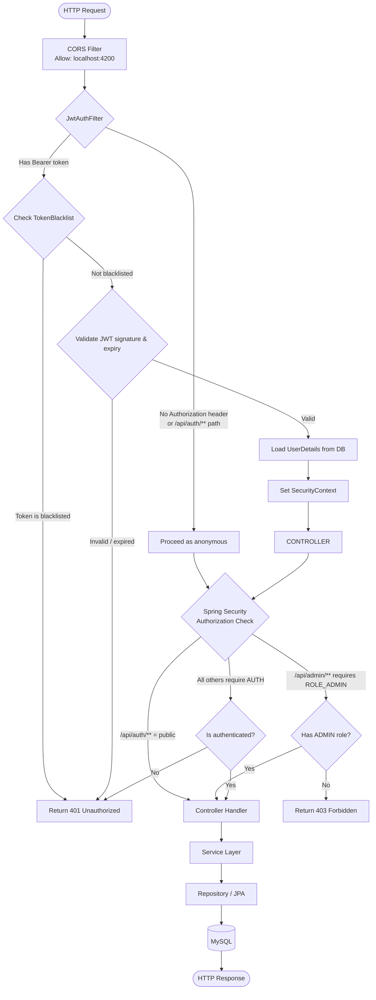

---

## 6. Database Entity Relationships

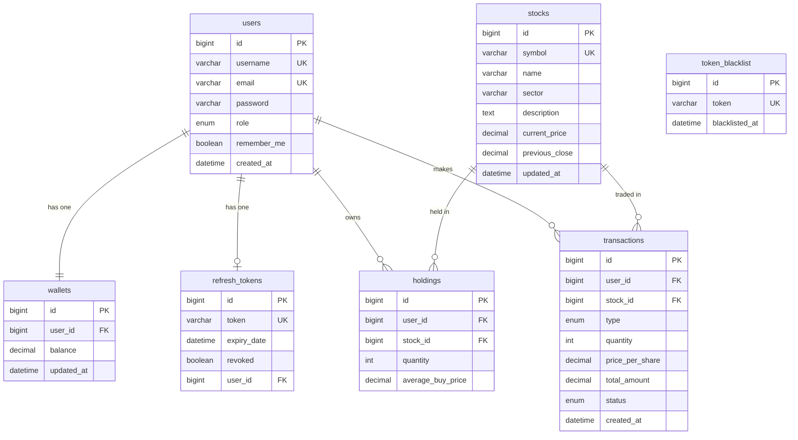

---

## 7. Real-time Price Simulation

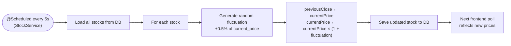

> **Note:** The frontend polls stock prices each time the user loads `/home` or opens the stock detail modal. There is no WebSocket push — the ±0.5% simulation runs server-side continuously regardless of active users.

---

## 8. Local Development Setup

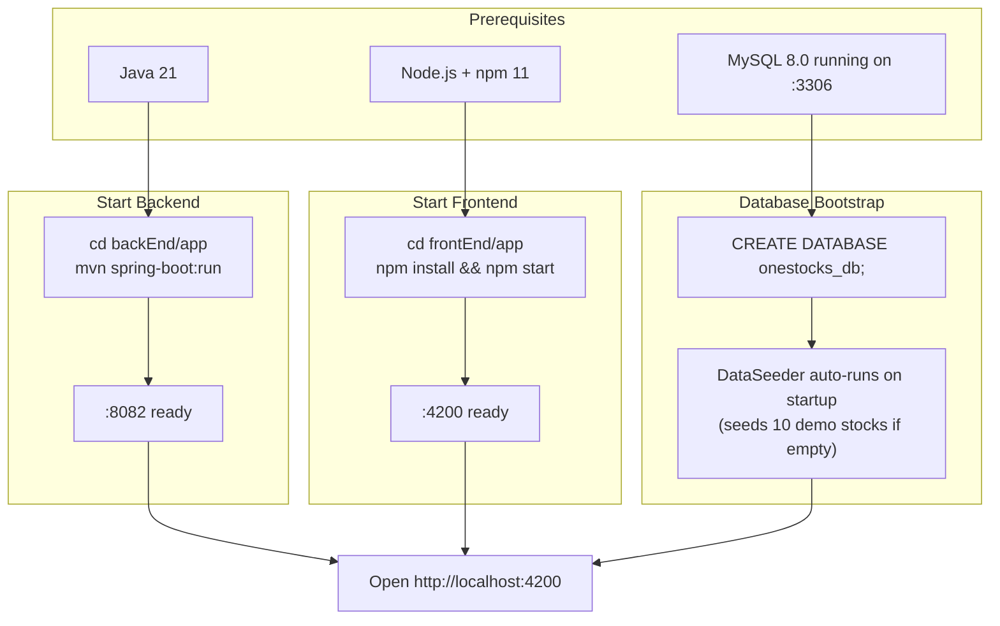

### Default Test Credentials
After starting the app, register a new account via `/signup`. The wallet is automatically seeded with **$10,000** on registration.

### Configuration Quick-Reference

| Setting | Value |
|---|---|
| Backend port | `8082` |
| Frontend port | `4200` |
| DB name | `onestocks_db` |
| DB user | `root` |
| JWT expiry | 24 hours |
| Refresh token expiry | 7 days |
| Price update interval | 5 seconds |
| Initial wallet balance | $10,000 |
